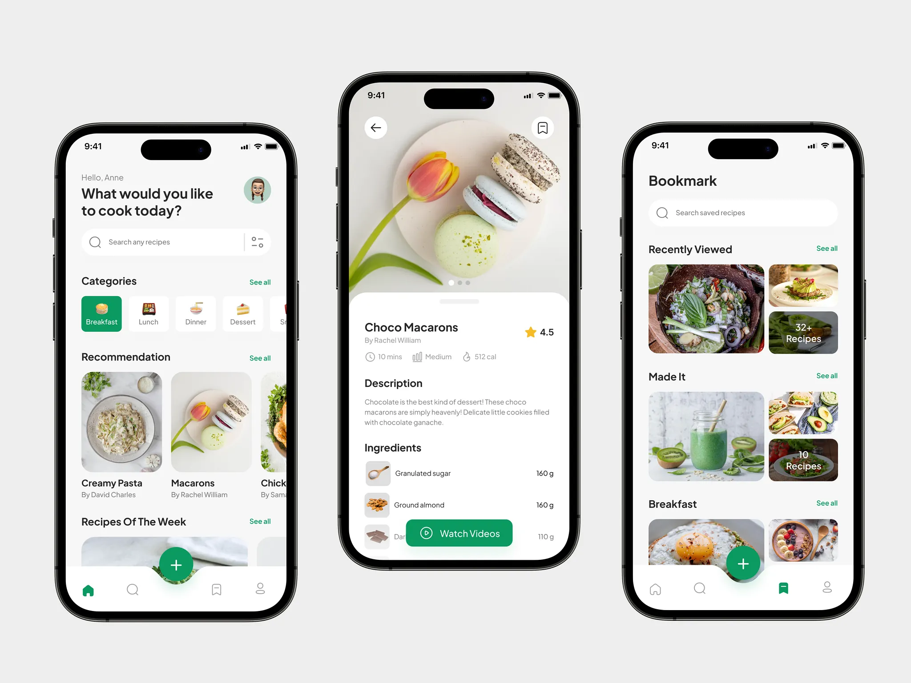
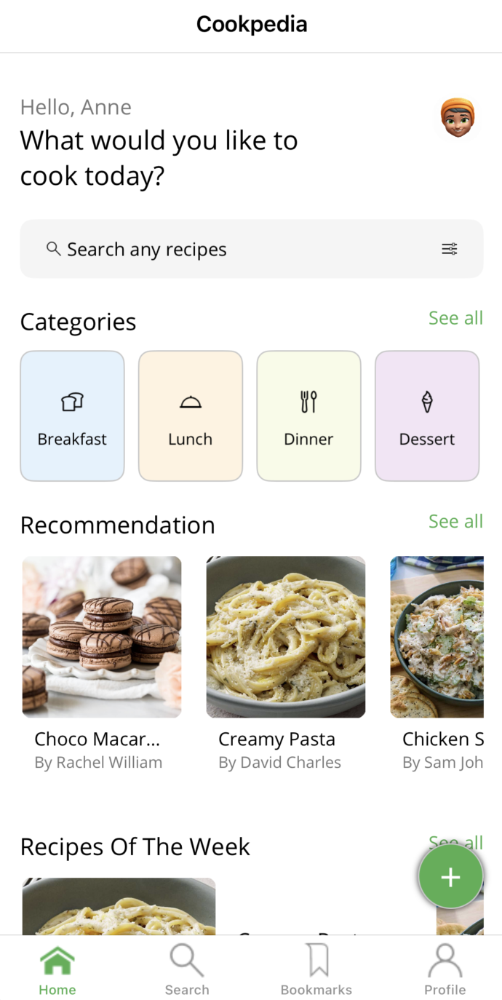
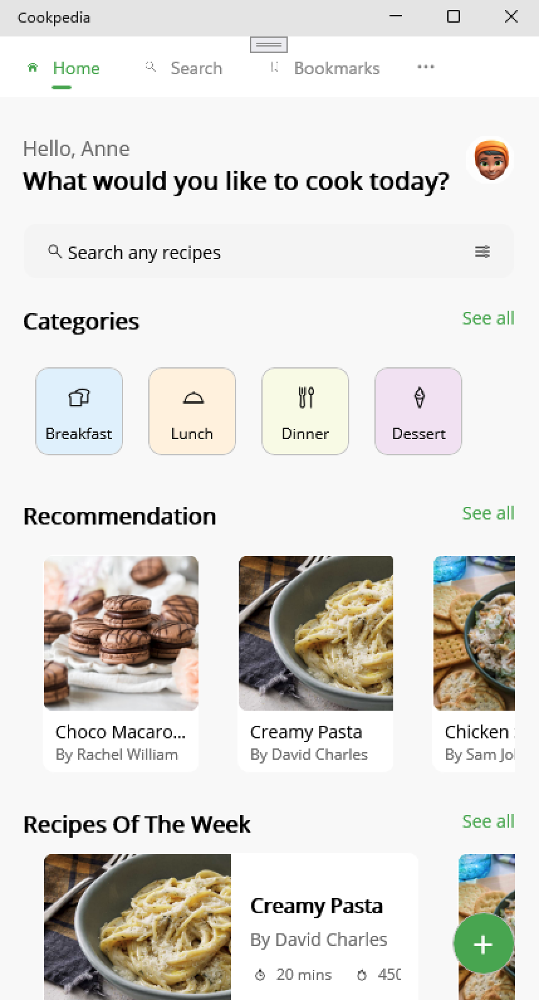

# April Scorecard Day: iOS Inner Loop Development Experience with .NET MAUI

The April Scorecard is a day focused on evaluating and refining the iOS inner loop development experience using .NET MAUI. This included streamlining debugging, remote connection and check the performance.
To debug and interact with other tools, created Cookpedia using AI, Claude 3.7 and GPT-4.5 based on [this design](https://dribbble.com/shots/20792040-Cookpedia-Food-Recipe-Mobile-App) by Rima Dwi Novika.

This is the result:

Mobile:

Desktop:

The AI successfully generated the pages, view models, styles, and other essential components. While the navigation and overall structure of each page are consistently designed, there is still room for refinement in the finer details to achieve greater alignment with the intended design.

This repository only contains the demo code used for debugging, memory profiling, or using tools like remote connection, etc. It does not include any of the reports.
